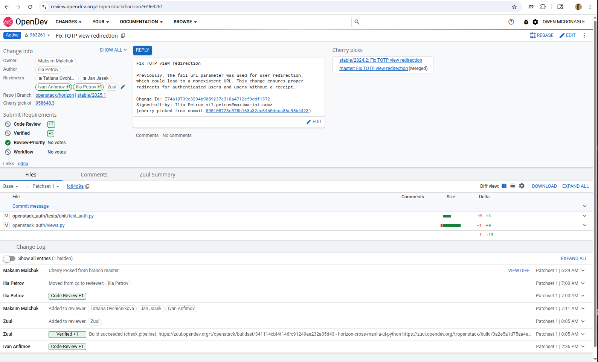
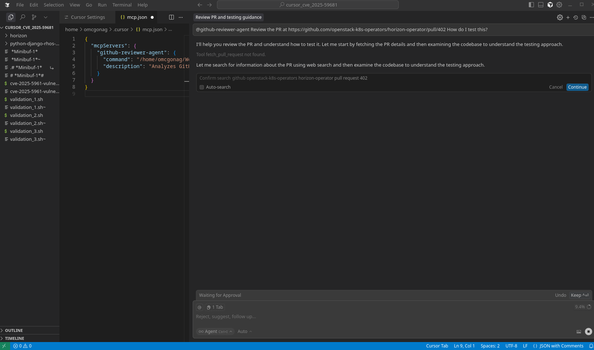

# My MCP Agents Collection

This repository demonstrates how to build custom MCP (Model Context Protocol) agents for Cursor. It contains three MCP agents that I built to analyze different types of code reviews.

> [!IMPORTANT]
> **Path Placeholder Convention**  
> Throughout this document, you'll see `<your-mymcp-cloned-repo-path>` used in code examples and configuration snippets.  
> **Replace this placeholder with the absolute path to where you cloned this repository.**  
>   
> For example:
> - Linux/Mac: `/home/username/projects/mymcp` or `/Users/username/projects/mymcp`
> - Windows: `C:\Users\username\projects\mymcp`

## TL;DR

This document describes how I built my MCP agents for Cursor, including:
- **cursor-github-agent**: Analyzes GitHub Pull Requests
- **cursor-opendev-review-agent**: Analyzes OpenDev Gerrit reviews  
- **jira-mcp**: Provides access to Jira issues from Cursor

## Table of Contents

- [Building an OpenDev Review Agent](#building-an-opendev-review-agent)
  - [Set Up the Environment](#set-up-the-environment)
  - [Define the MCP Server Script](#define-the-mcp-server-script-1)
  - [Create the Server Launcher](#create-the-server-launcher-1)
  - [Configure Cursor](#configure-cursor-1)
  - [Testing the Agent](#testing-the-agent-1)
- [Building a GitHub Review Agent](#building-a-github-review-agent)
  - [Set Up the Environment](#set-up-the-environment-1)
  - [Define the MCP Server Script](#define-the-mcp-server-script-2)
  - [Create the Server Launcher](#create-the-server-launcher-2)
  - [Configure Cursor](#configure-cursor-2)
  - [Testing the Agent](#testing-the-agent-2)
- [Jira MCP Agent](#jira-mcp-agent)
- [Additional Resources](#additional-resources)

---

## Building an OpenDev Review Agent

I wanted to build an agent for Cursor that analyzes OpenDev Gerrit reviews for OpenStack projects. Here's the step-by-step process.

### Background

The OpenDev review system uses Gerrit, which is different from GitHub's pull request model. Building a specialized agent for OpenDev reviews allows us to analyze OpenStack code changes using Cursor's AI capabilities. This agent leverages Gerrit's REST API to fetch review metadata, file changes, and comments.

This agent will be a tool that the LLM uses to answer the prompt: **"Review this change: &lt;OpenDev URL&gt;"**

### Set Up the Environment

First, set up a minimal Python environment for your MCP server, you can do this from directory `cursor-opendev-review-agent` of your repo:

```bash
mkdir cursor-opendev-review-agent
cd cursor-opendev-review-agent
python3 -m venv venv
source venv/bin/activate
pip install requests fastmcp
```

### Define the MCP Server Script

Create a file named `server.py`. This script will host the MCP server and define the **gerrit_review_fetcher** tool.

**Tool Definition:**
- **Tool Name**: `gerrit_review_fetcher`
- **Tool Action**: Retrieve review metadata, file changes, and comments from Gerrit API.

**See the complete implementation:** [`cursor-opendev-review-agent/server.py`](cursor-opendev-review-agent/server.py)

**Key Features:**
- **Gerrit API Integration**: Fetches review details from OpenDev's Gerrit REST API
- **Security Prefix Handling**: Strips the `)]}'` prefix that Gerrit adds for security
- **Comprehensive Data**: Retrieves change metadata, file statistics, and comments
- **URL Parsing**: Extracts change numbers from standard OpenDev review URLs

### Create the Server Launcher

Create a file named `server.sh`. This simple bash script activates the Python environment and runs the server script.

```bash
#!/bin/bash
# This script launches the OpenDev.Review MCP server

# Get the directory where this script is located
SCRIPT_DIR="$(cd "$(dirname "${BASH_SOURCE[0]}")" && pwd)"

# Activate the virtual environment
source "$SCRIPT_DIR/venv/bin/activate"

# Run the server script
python "$SCRIPT_DIR/server.py"
```

Make it executable:

```bash
chmod +x server.sh
```

### Configure Cursor

Now, tell Cursor where to find and how to run your new agent.

#### Step 1: Open Cursor Settings

Open Cursor's settings (**Cmd/Ctrl + Comma** or **File -> Settings**).


#### Step 2: Search for MCP Servers

Search for **MCP Servers** or go to **Features -> MCP Servers**.


#### Step 3: Add New Global MCP Server

Click **+ Add new global MCP server** and paste this JSON configuration (remember to replace `<your-mymcp-cloned-repo-path>`):

```json
{
  "mcpServers": {
    "opendev-reviewer-agent": {
      "command": "<your-mymcp-cloned-repo-path>/cursor-opendev-review-agent/server.sh",
      "description": "Analyzes OpenDev Gerrit reviews to perform automated code review."
    }
  }
}
```

#### Step 4: Save and Reload Cursor

**Save your new mcp.json configuration**  
Go to **File → Save** and then restart Cursor (**Ctrl+Shift+P** → "Developer: Reload Window")

### Testing the Agent

#### Invoke the OpenDev Cursor Agent on Review 960204

I tested my OpenDev Cursor agent on [Review 960204: Validate token before revoking in keystone_client](https://review.opendev.org/c/openstack/horizon/+/960204)

At the Cursor prompt, enter:

```
@opendev-reviewer-agent Analyze the review at https://review.opendev.org/c/openstack/horizon/+/960204
```



## Building a GitHub Review Agent

I wanted to build an agent for Cursor that analyzes GitHub reviews (pull requests). Here's the step-by-step process.

### Background

That's a fantastic idea! Building a specialized agent for code review is one of the most powerful uses of a custom LLM environment like Cursor. While Cursor doesn't have a direct *Agent Builder UI*, you can achieve this by creating a **custom Model Context Protocol (MCP) server** that provides GitHub pull request data as a *Tool* to the AI.

This agent will be a tool that the LLM uses to answer the prompt: **"Review this PR: &lt;GitHub URL&gt;"**

### Set Up the Environment

First, set up a minimal Python environment for your MCP server, you can do this from directory `cursor-github-agent` of your repo:

```bash
mkdir cursor-github-agent
cd cursor-github-agent
python3 -m venv venv
source venv/bin/activate
pip install requests fastmcp
pip install PyGithub
```

### Define the MCP Server Script

Create a file named `server.py`. This script will host the MCP server and define the **github_pr_fetcher** tool.

**Tool Definition:**
- **Tool Name**: `github_pr_fetcher`
- **Tool Action**: Retrieve the PR summary, file list, and diff content.

**See the complete implementation:** [`cursor-github-agent/server.py`](cursor-github-agent/server.py)

### Create the Server Launcher

Create a file named `server.sh`. This simple bash script activates the Python environment and runs the server script.

```bash
#!/bin/bash
# This script launches the MCP server

source "$(dirname "$0")/venv/bin/activate"
python "$(dirname "$0")/server.py"
```

Make it executable:

```bash
chmod +x server.sh
```

### Configure Cursor

Now, tell Cursor where to find and how to run your new agent.

#### Step 1: Open Cursor Settings

Open Cursor's settings (**Cmd/Ctrl + Comma** or **File -> Settings**).


#### Step 2: Search for MCP Servers

Search for **MCP Servers** or go to **Features -> MCP Servers**.


#### Step 3: Add New Global MCP Server

Click **+ Add new global MCP server** and paste this JSON configuration:


Paste the below JSON configuration (remember to replace `<your-mymcp-cloned-repo-path>`):


```json
{
  "mcpServers": {
    "github-reviewer-agent": {
      "command": "<your-mymcp-cloned-repo-path>/cursor-github-agent/server.sh",
      "description": "Analyzes GitHub pull requests to perform automated code review."
    }
  }
}
```

#### Step 4: Save and Reload Cursor

**Save your new mcp.json configuration**  
Go to **File → Save** and then restart Cursor (**Ctrl+Shift+P** → "Developer: Reload Window")

### Testing the Agent

#### Invoke the GitHub Cursor Agent on PR-402

I tested my GitHub Cursor agent on [PR-402: Allow customize http vhost config using HttpdCustomization.CustomConfigSecret](https://github.com/openstack-k8s-operators/horizon-operator/pull/402)

At the Cursor prompt, enter:

```
@github-reviewer-agent Review the PR at https://github.com/openstack-k8s-operators/horizon-operator/pull/402 How do I test this?
```


## Troubleshooting

### Why do I see "Tool fetch_pull_request not found"?

This is okay to ignore for now.



### Verifying OpenDev Review Agent is Operational

To test if your OpenDev review agent is working correctly, run this command from your terminal:

```bash
cd <your-mymcp-cloned-repo-path>/cursor-opendev-review-agent
bash server.sh <<< '{"jsonrpc": "2.0", "method": "exit"}' 2>&1 | head -20
```

If working correctly, you should see output like:

```
╭────────────────────────────────────────────────────────────────────────────╮
│                                                                            │
│        _ __ ___  _____           __  __  _____________    ____    ____     │
│       _ __ ___ .'____/___ ______/ /_/  |/  / ____/ __ \  |___ \  / __ \    │
│      _ __ ___ / /_  / __ `/ ___/ __/ /|_/ / /   / /_/ /  ___/ / / / / /    │
│     _ __ ___ / __/ / /_/ (__  ) /_/ /  / / /___/ ____/  /  __/_/ /_/ /     │
│    _ __ ___ /_/    \____/____/\__/_/  /_/\____/_/      /_____(*)____/      │
│                                                                            │
│                                                                            │
│                                FastMCP  2.0                                │
│                                                                            │
│                                                                            │
│                 🖥️  Server name:     opendev-reviewer                       │
│                 📦 Transport:       STDIO                                  │
│                                                                            │
│                 🏎️  FastMCP version: 2.12.5                                 │
│                 🤝 MCP SDK version: 1.16.0                                 │
│                                                                            │
```

This confirms the MCP server starts successfully.

---

## Jira MCP Agent

The third agent provides access to Jira from Cursor. See the [jira-mcp](jira-mcp/) directory for the complete implementation with containerized deployment.

This is a more mature implementation that includes:
- Containerized deployment with Podman
- 20+ Jira tools (issue search, project management, board & sprint management, user management)
- Production-ready setup with proper authentication

For detailed setup instructions, see [jira-mcp/README.md](jira-mcp/README.md).

---

## Additional Resources

### Related Documentation

- [OpenDev MCP Agent Setup Guide](cursor-opendev-review-agent/opendev-mcp-agent-setup.org) - Detailed setup documentation in org-mode format

### Directory Structure

```
mymcp/
├── README.md                           # This file
├── cursor-github-agent/                # GitHub PR review agent
│   ├── server.py                       # Main MCP server
│   ├── server.sh                       # Launch script
│   └── requirements.txt                # Python dependencies
├── cursor-opendev-review-agent/        # OpenDev Gerrit review agent
│   ├── server.py                       # Main MCP server
│   ├── server.sh                       # Launch script
│   └── requirements.txt                # Python dependencies
├── jira-mcp/                           # Jira integration agent
│   ├── server.py                       # Main MCP server
│   ├── requirements.txt                # Python dependencies
│   ├── Containerfile                   # Container definition
│   ├── Makefile                        # Build and setup automation
│   ├── example.env                     # Environment variables template
│   ├── example.mcp.json                # MCP configuration template
│   └── LICENSE                         # MIT License
└── images/                             # Screenshots and documentation images
```

### Setup Instructions for Participants

If you're attending my demonstration and want to follow along:

1. **Clone this repository**:
   ```bash
   git clone https://github.com/mcgonago/mymcp.git
   cd mymcp
   ```

2. **Choose an agent to set up** (start with cursor-github-agent for simplest):
   ```bash
   cd cursor-github-agent
   python3 -m venv venv
   source venv/bin/activate
   pip install -r requirements.txt
   chmod +x server.sh
   ```

3. **Configure Cursor**:
   - Open Cursor Settings (Cmd/Ctrl + ,)
   - Navigate to Features → MCP Servers
   - Add your agent configuration (see examples above)

4. **Test your agent**:
   - Try asking Cursor to review a PR or issue
   - Use the `@agent-name` syntax in your prompts

### Complete Testing and Verification Guide

#### Pre-Configuration Testing

Before configuring agents in Cursor, verify they're properly set up:

```bash
# Test OpenDev Agent
cd <your-mymcp-cloned-repo-path>/cursor-opendev-review-agent
ls -la server.sh server.py
source venv/bin/activate
python -c "import fastmcp, requests; print('Dependencies OK')"
deactivate

# Test GitHub Agent
cd <your-mymcp-cloned-repo-path>/cursor-github-agent
ls -la server.sh server.py
source venv/bin/activate
python -c "import fastmcp, requests; print('Dependencies OK')"
deactivate

# Test Jira MCP Agent (if using)
cd <your-mymcp-cloned-repo-path>/jira-mcp
podman images | grep jira-mcp
test -f .env && echo ".env exists" || echo ".env missing"
```

#### Complete MCP Configuration for All Three Agents

To configure all agents in Cursor at once:

1. Open Cursor Settings (**Ctrl/Cmd + ,**)
2. Search for: **MCP Servers**
3. Paste this complete configuration (remember to replace `<your-mymcp-cloned-repo-path>`):

```json
{
  "mcpServers": {
    "opendev-reviewer-agent": {
      "command": "<your-mymcp-cloned-repo-path>/cursor-opendev-review-agent/server.sh",
      "description": "Analyzes OpenDev Gerrit reviews to perform automated code review."
    },
    "github-reviewer-agent": {
      "command": "<your-mymcp-cloned-repo-path>/cursor-github-agent/server.sh",
      "description": "Analyzes GitHub pull requests to perform automated code review."
    },
    "jira-mcp": {
      "command": "podman",
      "args": [
        "run",
        "--rm",
        "-i",
        "--env-file",
        "<your-mymcp-cloned-repo-path>/jira-mcp/.env",
        "jira-mcp:latest"
      ],
      "description": "Provides access to Jira issues, projects, boards, and sprints."
    }
  }
}
```

4. **Save your new mcp.json configuration**  
   Go to **File → Save** and then restart Cursor (**Ctrl+Shift+P** → "Developer: Reload Window")

#### Testing Each Agent

After configuration, test each agent in Cursor:

**OpenDev Agent:**
```
@opendev-reviewer-agent Analyze https://review.opendev.org/c/openstack/horizon/+/960204
```

**GitHub Agent:**
```
@github-reviewer-agent Review https://github.com/openstack-k8s-operators/horizon-operator/pull/402
```

**Jira MCP Agent:**
```
@jira-mcp Search for issues in project OSPRH
```

```
@jira-mcp Get details for issue OSPRH-18672
```

#### Removing and Re-adding Agents

To test the complete setup process:

1. **Remove all agents** - Replace MCP configuration with:
   ```json
   {
     "mcpServers": {}
   }
   ```

2. **Restart Cursor** and verify agents don't work

3. **Re-add agents** using the complete configuration above

4. **Restart Cursor** and verify all agents work

#### Troubleshooting

**If an agent doesn't respond:**
- Verify the `command` path is correct and absolute
- Check that `server.sh` is executable (`chmod +x server.sh`)
- Ensure virtual environment has all dependencies
- Restart Cursor after configuration changes

**For Jira MCP specifically:**
- Verify container image is built: `podman images | grep jira-mcp`
- Check `.env` file has `JIRA_URL` and `JIRA_API_TOKEN`
- Ensure `--env-file` path is absolute

**If you see "Tool not found" errors:**
- This is often normal during initial connection
- The agent is connected, but specific tools may not be fully loaded
- Try the command again after a few seconds

#### Key Differences Between Agents

**OpenDev & GitHub Agents:**
- Simple shell script execution
- Uses `venv` for Python dependencies
- Direct server.py execution

**Jira MCP Agent:**
- Containerized deployment with Podman
- Uses `--env-file` for credentials
- Runs in isolated container environment
- More secure (credentials never in config file)
- 20+ tools for comprehensive Jira integration

### Contributing

This repository is primarily for educational purposes and demonstration. Feel free to fork and adapt for your own MCP agents!

### License

- `jira-mcp` is licensed under the MIT License
- Other agents are provided as examples for educational purposes

---

## Questions?

If you have questions during the demonstration or while following along, please feel free to reach out or open an issue in this repository.

**Happy MCP building!** 🚀

