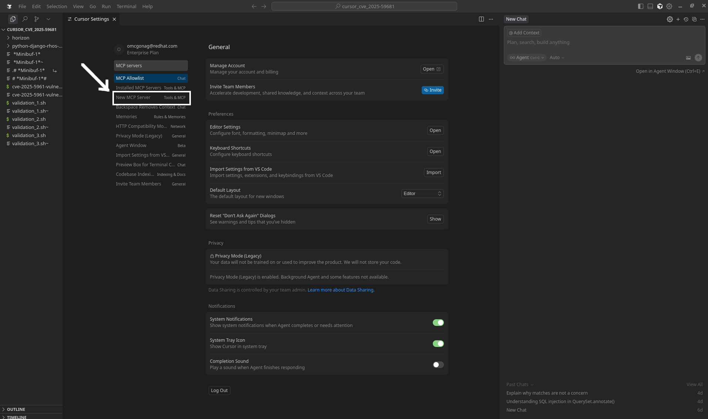

# GitHub Review Agent

An MCP (Model Context Protocol) agent for Cursor that analyzes GitHub Pull Requests.

> **Note**: The steps below can be executed from within the repository where the `server.sh` and `server.py` files are located.

## Background

That's a fantastic idea! Building a specialized agent for code review is one of the most powerful uses of a custom LLM environment like Cursor. While Cursor doesn't have a direct *Agent Builder UI*, you can achieve this by creating a **custom Model Context Protocol (MCP) server** that provides GitHub pull request data as a *Tool* to the AI.

This agent will be a tool that the LLM uses to answer the prompt: **"Review this PR: &lt;GitHub URL&gt;"**

## Set Up the Environment

First, set up a minimal Python environment for your MCP server, you can do this from directory `github-agent` of your repo:

```bash
mkdir github-agent
cd github-agent
python3 -m venv venv
source venv/bin/activate
pip install requests fastmcp
pip install PyGithub
```

## Configure GitHub Authentication

The GitHub agent requires a personal access token to fetch PR data from the GitHub API.

### Create a GitHub Personal Access Token

1. Go to https://github.com/settings/tokens
2. Click **"Generate new token"** → **"Generate new token (classic)"**
3. Give it a descriptive name: `Cursor GitHub MCP Agent`
4. Select scopes:
   - ✅ `public_repo` (for accessing public repositories)
   - ✅ `repo` (only if you need access to private repositories)
5. Click **"Generate token"**
6. **Copy the token** (you won't be able to see it again!)

### Set Up the Environment File

Create a `.env` file in the `github-agent` directory:

```bash
cd github-agent
cp example.env .env
```

Edit the `.env` file and replace `your_github_token_here` with your actual token:

```bash
GITHUB_TOKEN=ghp_your_actual_token_here
```

> [!WARNING]
> **Never commit the `.env` file to Git!** It contains your personal access token.  
> The `.gitignore` file is already configured to exclude it.

## Define the MCP Server Script

Create a file named `server.py`. This script will host the MCP server and define the **github_pr_fetcher** tool.

**Tool Definition:**
- **Tool Name**: `github_pr_fetcher`
- **Tool Action**: Retrieve the PR summary, file list, and diff content.

**See the complete implementation:** [`server.py`](server.py)

## Create the Server Launcher

Create a file named `server.sh`. This simple bash script activates the Python environment and runs the server script.

```bash
#!/bin/bash
# This script launches the MCP server

# Get the directory of this script
SCRIPT_DIR="$(dirname "$0")"

# Load .env file if it exists
if [ -f "$SCRIPT_DIR/.env" ]; then
    export $(cat "$SCRIPT_DIR/.env" | grep -v '^#' | xargs)
fi

# Activate virtual environment and run server
source "$SCRIPT_DIR/venv/bin/activate"
python "$SCRIPT_DIR/server.py"
```

Make it executable:

```bash
chmod +x server.sh
```

## Configure Cursor

Now, tell Cursor where to find and how to run your new agent.

### Step 1: Open Cursor Settings

Open Cursor's settings (**Cmd/Ctrl + Comma** or **File -> Settings**).


### Step 2: Search for MCP Servers

Search for **MCP Servers** or go to **Features -> MCP Servers**.



### Step 3: Add New Global MCP Server

Click **+ Add new global MCP server** and paste this JSON configuration:


Paste the below JSON configuration (remember to replace `<your-mymcp-cloned-repo-path>`):


```json
{
  "mcpServers": {
    "github-reviewer-agent": {
      "command": "<your-mymcp-cloned-repo-path>/github-agent/server.sh",
      "description": "Analyzes GitHub pull requests to perform automated code review."
    }
  }
}
```

### Step 4: Save and Reload Cursor

**Save your new mcp.json configuration**  
Go to **File → Save** and then restart Cursor (**Ctrl+Shift+P** → "Developer: Reload Window")

> **Note**: Alternatively, you can fully exit Cursor (**Ctrl+Q**) and restart it, which will also reload the new settings.

## Testing the Agent

### Invoke the GitHub Cursor Agent on PR-402

I tested my GitHub Cursor agent on [PR-402: Allow customize http vhost config using HttpdCustomization.CustomConfigSecret](https://github.com/openstack-k8s-operators/horizon-operator/pull/402)

At the Cursor prompt, enter:

```
@github-reviewer-agent Review the PR at https://github.com/openstack-k8s-operators/horizon-operator/pull/402 How do I test this?
```


## Files

- `server.py` - Main MCP server implementation
- `server.sh` - Launch script (loads `.env` for GitHub token)
- `example.env` - Template for environment variables
- `.gitignore` - Ensures `.env` is not committed
- `requirements.txt` - Python dependencies
- `SETUP.md` - Additional setup instructions

## Related Documentation

- [SETUP.md](SETUP.md) - Detailed setup guide for GitHub authentication
