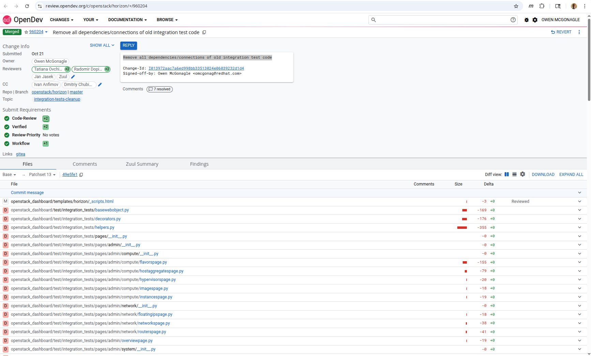

# OpenDev Review Agent

An MCP (Model Context Protocol) agent for Cursor that analyzes OpenDev Gerrit code reviews for OpenStack projects.

> **Note**: The steps below can be executed from within the repository where the `server.sh` and `server.py` files are located.

## Background

The OpenDev review system uses Gerrit, which is different from GitHub's pull request model. Building a specialized agent for OpenDev reviews allows us to analyze OpenStack code changes using Cursor's AI capabilities. This agent leverages Gerrit's REST API to fetch review metadata, file changes, and comments.

This agent will be a tool that the LLM uses to answer the prompt: **"Review this change: &lt;OpenDev URL&gt;"**

## Set Up the Environment

First, set up a minimal Python environment for your MCP server, you can do this from directory `opendev-review-agent` of your repo:

```bash
mkdir opendev-review-agent
cd opendev-review-agent
python3 -m venv venv
source venv/bin/activate
pip install requests fastmcp
```

## Define the MCP Server Script

Create a file named `server.py`. This script will host the MCP server and define the **gerrit_review_fetcher** tool.

**Tool Definition:**
- **Tool Name**: `gerrit_review_fetcher`
- **Tool Action**: Retrieve review metadata, file changes, and comments from Gerrit API.

**See the complete implementation:** [`server.py`](server.py)

**Key Features:**
- **Gerrit API Integration**: Fetches review details from OpenDev's Gerrit REST API
- **Security Prefix Handling**: Strips the `)]}'` prefix that Gerrit adds for security
- **Comprehensive Data**: Retrieves change metadata, file statistics, and comments
- **URL Parsing**: Extracts change numbers from standard OpenDev review URLs

## Create the Server Launcher

Create a file named `server.sh`. This simple bash script activates the Python environment and runs the server script.

```bash
#!/bin/bash
# This script launches the OpenDev.Review MCP server

# Get the directory where this script is located
SCRIPT_DIR="$(cd "$(dirname "${BASH_SOURCE[0]}")" && pwd)"

# Activate the virtual environment
source "$SCRIPT_DIR/venv/bin/activate"

# Run the server script
python "$SCRIPT_DIR/server.py"
```

Make it executable:

```bash
chmod +x server.sh
```

## Configure Cursor

Now, tell Cursor where to find and how to run your new agent.

### Step 1: Open Cursor Settings

Open Cursor's settings (**Cmd/Ctrl + Comma** or **File -> Settings**).


### Step 2: Search for MCP Servers

Search for **MCP Servers** or go to **Features -> MCP Servers**.


### Step 3: Add New Global MCP Server

Click **+ Add new global MCP server** and paste this JSON configuration (remember to replace `<your-mymcp-cloned-repo-path>`):

```json
{
  "mcpServers": {
    "opendev-reviewer-agent": {
      "command": "<your-mymcp-cloned-repo-path>/opendev-review-agent/server.sh",
      "description": "Analyzes OpenDev Gerrit reviews to perform automated code review."
    }
  }
}
```

### Step 4: Save and Reload Cursor

**Save your new mcp.json configuration**
Go to **File → Save** and then restart Cursor (**Ctrl+Shift+P** → "Developer: Reload Window")

> **Note**: Alternatively, you can fully exit Cursor (**Ctrl+Q**) and restart it, which will also reload the new settings.

## Testing the Agent

### Invoke the OpenDev Cursor Agent on Review 960204

I tested my OpenDev Cursor agent on [Review 960204: Remove all dependencies/connections of old integration test code](https://review.opendev.org/c/openstack/horizon/+/960204)

At the Cursor prompt, enter:

```
@opendev-reviewer-agent Analyze the review at https://review.opendev.org/c/openstack/horizon/+/960204
```



## Verifying OpenDev Review Agent is Operational

To test if your OpenDev review agent is working correctly, run this command from your terminal:

```bash
cd <your-mymcp-cloned-repo-path>/opendev-review-agent
bash server.sh <<< '{"jsonrpc": "2.0", "method": "exit"}' 2>&1 | head -20
```

If working correctly, you should see output like:

```
╭──────────────────────────────────────────────────────────────────────────────╮
│                                                                              │
│                         ▄▀▀ ▄▀█ █▀▀ ▀█▀ █▀▄▀█ █▀▀ █▀█                        │
│                         █▀  █▀█ ▄▄█  █  █ ▀ █ █▄▄ █▀▀                        │
│                                                                              │
│                                FastMCP 2.13.0                                │
│                                                                              │
│                                                                              │
│                    🖥  Server name: opendev-reviewer                          │
│                                                                              │
│                    📦 Transport:   STDIO                                     │
│                                                                              │
│                    📚 Docs:        https://gofastmcp.com                     │
│                    🚀 Hosting:     https://fastmcp.cloud                     │
│                                                                              │
╰──────────────────────────────────────────────────────────────────────────────╯
```

This confirms the MCP server starts successfully.

## Files

- `server.py` - Main MCP server implementation
- `server.sh` - Launch script
- `requirements.txt` - Python dependencies
